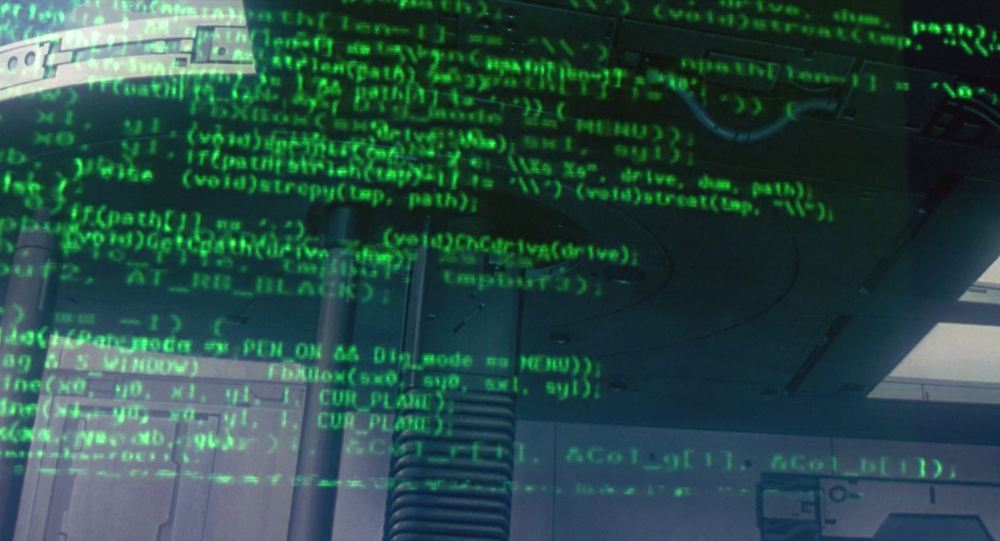

# Matrix

> A Solidity library for matrix operations.

## 

## Install

```sh
forge install heatdeathx/matrix
```

## Usage

```solidity
/** 
 * [[1, 2, 3, 4],  -> [[2, 10],
 *  [5, 6, 7, 8]]  ->  [4, 12]
 *                 ->  [6, 14]
 *                 ->  [8, 16]]
 */

contract C {
    function run() public {
        int256[][] memory A = Matrix.from(2, 4);
        int256[][] memory B = Matrix.from(4, 2);

        (uint256 m, uint256 n) = A.shape();

        int256 count = 1;

        for (uint256 i = 0; i < m; i++) {
            for (uint256 j = 0; j < n; j++) {
                A[i][j] += count++;
            }
        }

        return A.T().mul(2);
    }
}
```

## License

The code is released under `The MIT License (MIT)` license.
